# PropertyLister

## **Introduction**

Welcome to PropertyLister, the ultimate real estate search experience! Our app allows you to easily and quickly explore a wide variety of listings tailored to your needs.

*Welcome to [Guilty Sheep](https://propertylister.streamlit.app)*

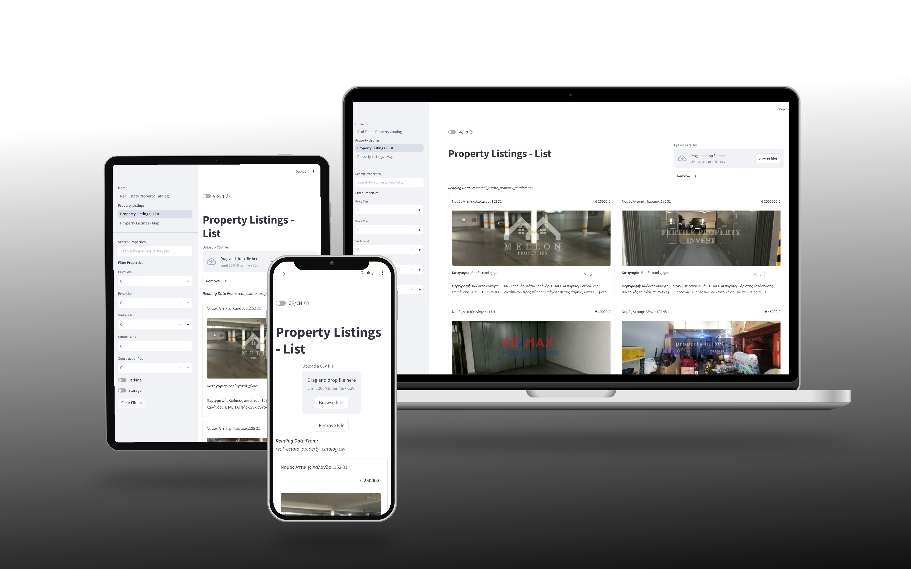

# **Contents**

- [**PropertyLister**](#PropertyLister)
- [**Introduction**](#introduction)
- [**Contents**](#contents)
- [**User Experience (UX)**](#user-experience-ux)
    - [**User Stories**](#user-stories)
    - [**Wireframes**](#wireframes)
    - [**ER Diagram**](#er-diagram)
    - [**Site Structure**](#site-structure)
- [**Design**](#design)
- [**Features**](#features)
- [**Existing features**](#existing-features)
- [**Technologies Used**](#technologies-used)
- [**Testing**](#testing)
- [**Deployment**](#deployment)
- [**Credits**](#credits)
- [**Acknowledgements**](#acknowledgements)


# **User Experience (UX)**

## **User Stories**

- **Viewing and Navigation:**
    - As a user, I want to view a list of properties, so I can browse through available items.
    - As a user, I want to view individual property details, so I can learn more about the item before purchasing.
    - As a user, I want to easily switch between map and image view in the property details page, so I can easily see the property's location
    - As a user, I want to see a description of each property listing, so I can read more details around potential purchuses

- **Sorting and Searching:**
    - As a user, I want to sort properties by various criteria (e.g., min/max price, min/max surface area), so I can easily find what I am looking for.
    - As a user, I want to filter products based on attributes (e.g., parking, storage), so I can narrow down my choices.
    - As a user, I want to search for products by keywords, so I can quickly locate specific items.

- **Interactive Map View with Markers:**
    - As a user, I want to view properties on an interactive map with markers, so I can easily see their locations.
    - As a user, I want to filter properties on the map based on attributes (e.g., parking, storage), so I can narrow down my choices visually.
    - As a user, I want to search for properties by keywords within the map view, so I can quickly locate specific listings in my area of interest.
    - As a user, I want to sort properties displayed on the map by criteria (e.g., min/max price, min/max surface area), so I can prioritize listings based on my preferences.

- **Language Toggle**

    - As a user, I want the option to change between greek and english language, so I can use the app even if I do not speak greek.

- **Upload data**
    - As a user, I want to have the option of uploading my own property listing data, so I can explore my own set of data

- **Analytics**
    - As a user, I want to have access to analytics around the properties such as mean price and number of properties, so I can better inform my decision

[Back to top](#contents)

## **Wireframes**

The wireframes for PropertiListing were produced in [Wireframe.cc](https://wireframe.cc). Inclued below, frames can be found for all distinct pages (home, rules, board) in desktop, mobile and tablet view as they were initially envisioned.

- Home Page

    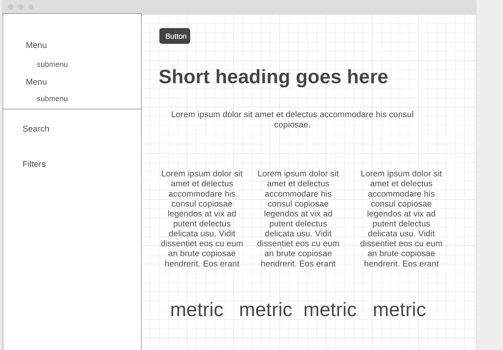

- List Page

    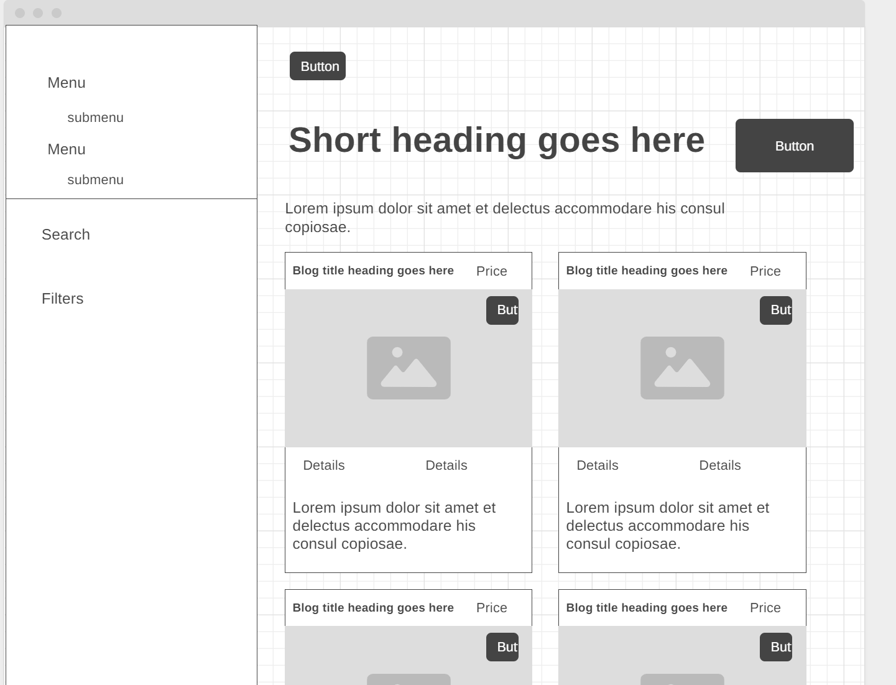

- Map Page

    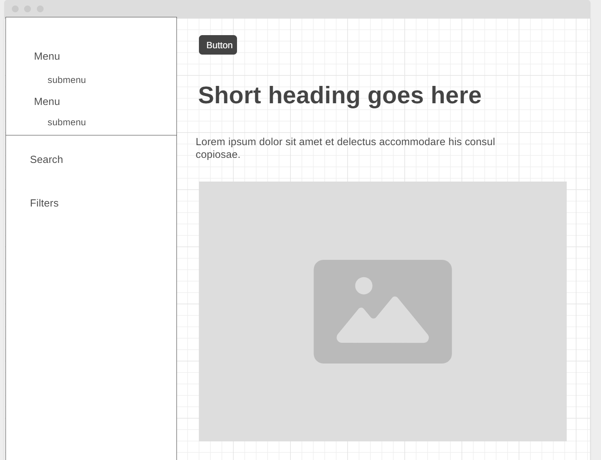

[Back to top](#contents)

## **Site Structure**

The project includes 3 main pages:

- Home Page — Serves as the landing page with a search bar, featured properties, and quick filters to help users start their search.

- List View Page — Displays a list of properties with sorting, filtering, and keyword search options. Each property features a "View Details" button that opens a dedicated Property Details Page with complete information, images, and contact options.

- Map View Page — Shows properties on an interactive map with markers. Users can sort, filter, and search properties directly on the map. Clicking a marker reveals a quick preview and a "View Details" button for the full property page.

Additional Page:

- Property Details Page — Provides in-depth information on a selected property, including price, features, images, and a contact form.

[Back to top](#contents)

## **Design**

- *Typography*

    All text on the website is using a the default streamlit font to convey simplocity, professionalism and modernity

- *Colour palette*

    The color palette chosen for the website consists of three main colors: Black, White, and Red. These colors create a simple yet elegant look, perfect for a data analysis web app.
    
    - Black: rgb(49, 51, 63);
    - White: rgb(255, 255, 255);
    - Rebeccapurple: #ff5454

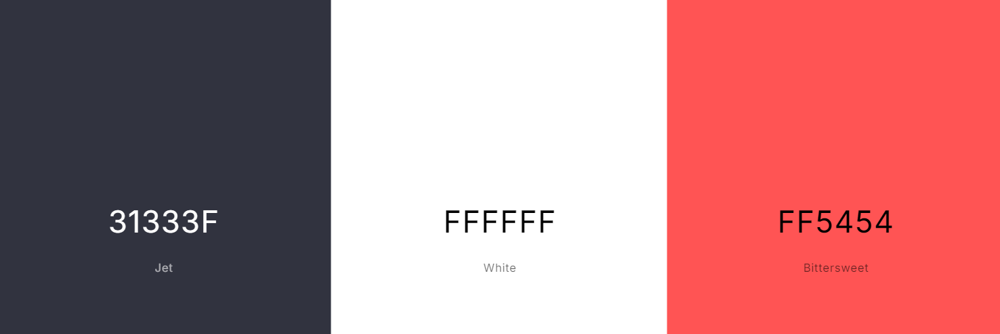

[Back to top](<#contents>)

# **Features**

The Guilty Sheep wesite is designed to be simple to navigate and easy to use.

## **Existing features**

- ### **Property Listings**

Users can explore available properties through two main views: a List View and an Interactive Map View. Each listing includes images, key details (e.g., price, size, location), and a quick-access button to view full details.

- List View
    - Displays properties as cards with images and essential information, allowing users to browse and compare multiple listings efficiently.

    - *List View*

        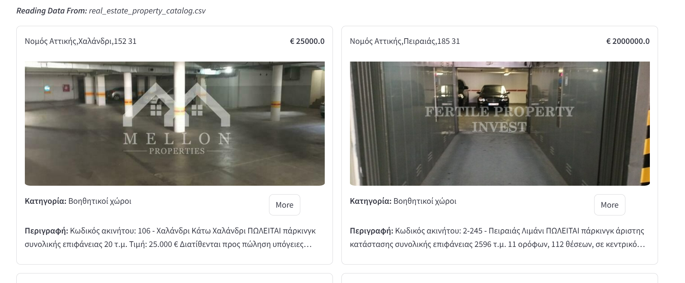

- Interactive Map View

    - Properties are displayed as markers on a fully interactive map, enabling users to explore locations visually. Clicking on a marker reveals a quick preview with key details and a link to the full property page

    - *Interactive Map View*

        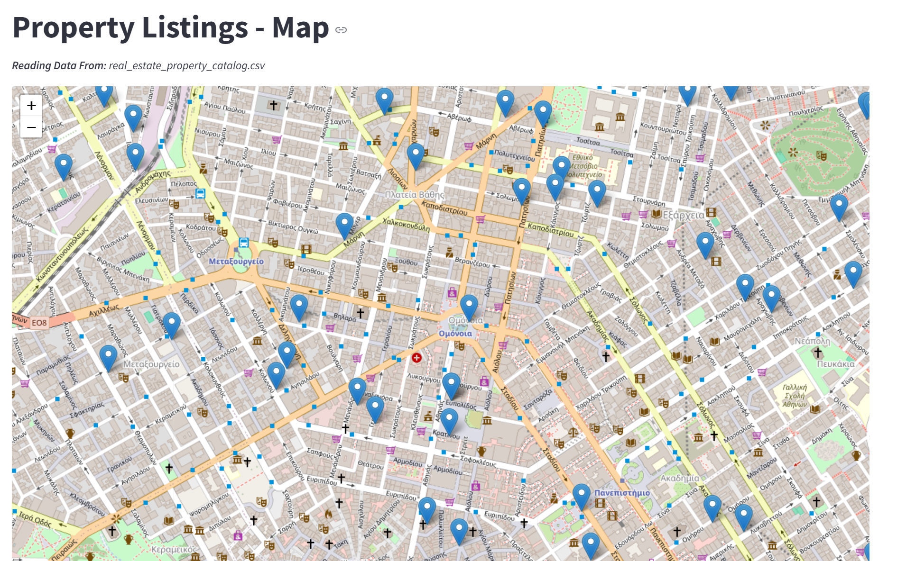

- ### **Full Details View**

    Each property has a dedicated Full Details Page, providing a comprehensive overview of the listing, including:
    - Complete property specifications (price, surface area, construction year, features, etc.).
    - Interactive Map Toggle, allowing users to switch between the property images and map location view for better context.

     - *Full Details View*
        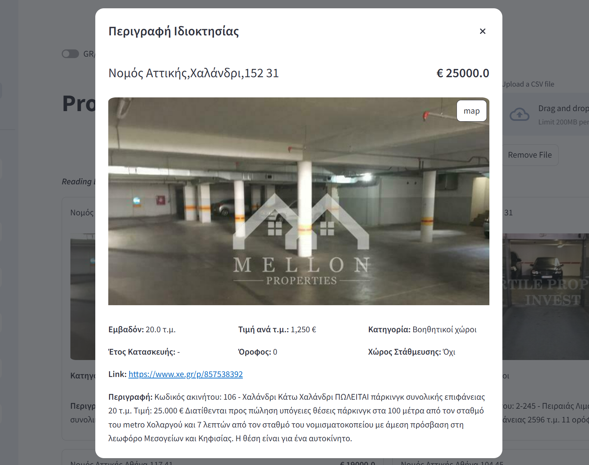

- ### **Advanced Search & Filterings**

    To help users find the most relevant properties, PropertyLister includes powerful search and filtering options:
    
    - **Keyword Search:** Users can search for properties by keywords related to descriptions, locations, or features.
    - **Sorting Options:** Users can sort listings by price (min/max) and surface area (min/max) for easier comparison.
    - **Filters:** Users can refine their search by:
        - Minimum & maximum price
        - Minimum & maximum surface area
        - Construction year
        - Parking availability
        - Storage availability

    - *Advanced Search & Filterings*

        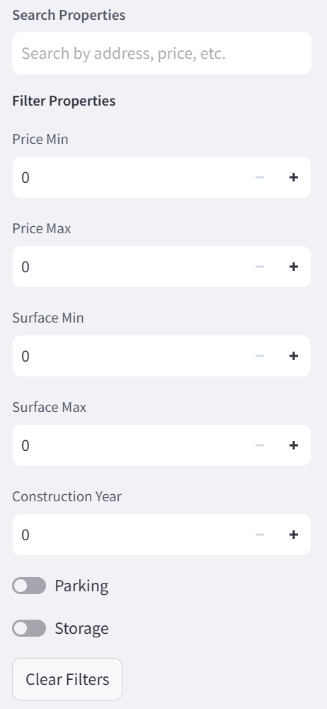

- ### **Data Insights & Analytics**

    The Home Page provides key insights into the available properties, including:
    
    - The total number of properties listed.
    - The total number of detail points
    - The average price of properties.
    - The average surface area of properties

    - *Data Insights & Analytics*

        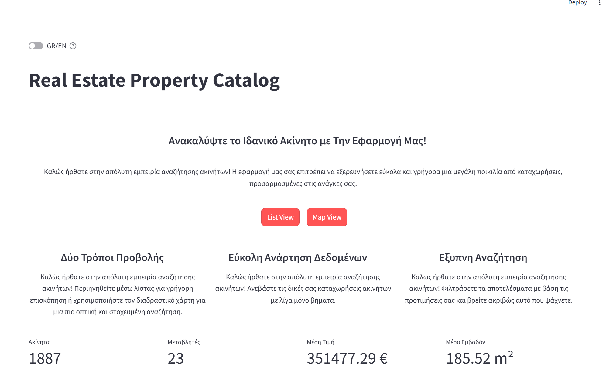

- ### **Upload Own Data**

    Users can upload their own property data, making it easy for sellers, agents, or platform admins to add new listings. The upload feature ensures that listings remain up-to-date and relevant.

    - *Upload Own Data*

        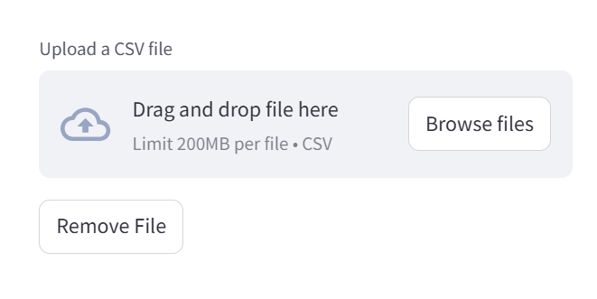

- ### **Language Toggle (EN/GR)**

    To accommodate a broader audience, the app includes a language toggle feature, allowing users to seamlessly switch between English and Greek for a more personalized experience.

    - *Language Toggle (EN/GR)*

        

[Back to top](<#contents>)

# **Technologies Used**

- [Python](https://www.python.org) - backend
- [Streamlit](https://streamlit.io) - web application building library
- [Folium](https://python-visualization.github.io/folium/latest/) - Interactive Map Integration
- [HTML5](https://html.spec.whatwg.org) - content and structure of the website via templating
- [CSS3](https://www.w3.org/Style/CSS/Overview.en.html) - styling
- [Wireframe.cc](https://wireframe.ccm) - wireframes
- [GitHub](https://github.com) - hosting and storing
- [StreamlitCloud](https://streamlit.io/cloud) - deployment
- [GIMP](https://www.gimp.org) - image editing

[Back to top](<#contents>)

# **Testing**

Please follow this [link](./TESTING.md) to learn more about testing Guilty Sheep.

[Back to top](<#contents>)

# **Deployment**

### **Project Deployment Instructions**

This website is deployed on StreamlitCloud. Follow these steps to deploy the project:

## **Local Setup & Deployment**  

### **Local Setup**  

#### **Clone the Project:**  
- Log in to GitHub, navigate to the **PropertyLister** repository, and click on the **"Code"** button.  
- Copy the repository URL and run the following command in your terminal:  
  ```bash
  git clone <repository_url>
  cd PropertyLister
  ```

#### **Install Requirements:**  
- Ensure you have **Python 3.8+** installed.  
- Install all dependencies using:  
  ```bash
  pip install -r requirements.txt
  ```

#### **Run the App Locally:**  
- To test the app locally, run:  
  ```bash
  streamlit run app.py
  ```
  This will open the app in your browser at **`http://localhost:8501`**.

---

## **Streamlit Cloud Deployment**  

### **1. Create a Streamlit Cloud Account**  
- Visit [Streamlit Cloud](https://streamlit.io/cloud) and sign up/log in.  

#### **2. Create a New Project & Link GitHub Repository**  
- Click **"New App"** and connect your **GitHub account**.  
- Select the repository containing the **PropertyLister** project.  
- Choose the branch (e.g., `main` or `master`).  

#### **3. Configure App Settings**  
- In the **"Main file path"**, enter the entry file (e.g., `app.py`).  
- If your app requires **environment variables**, add them in the settings section.  

#### **4. Install Dependencies**  
- Ensure a `requirements.txt` is present in the repository with all required packages (e.g., `streamlit`, `pandas`, `geopandas` for maps, etc.).  
- If missing, generate it using:  
  ```bash
  pip freeze > requirements.txt
  ```

#### **5. Deploy the App**  
- Click **"Deploy"**, and Streamlit Cloud will handle the deployment.  
- After a few minutes, the live app link will be available.  

#### **6. Updating the Deployed App**  
- Any changes pushed to the repository will trigger an automatic redeployment.  
- Alternatively, you can manually **"Reboot"** the app from the **Streamlit Cloud dashboard**.  

[Back to top](#contents)

# **Credits**

- Streamlit: - [Streamlit](https://streamlit.io)
- Folium: [Folium](https://python-visualization.github.io/folium/latest/)
- Wireframes: [Wireframe.cc](https://wireframe.cc)
- Image Editing: [GIMP 2.10.34](https://www.gimp.org)
- Color Palette: [Coolors](https://coolors.co)


[Back to top](<#contents>)

Sergios Papastergiou
2025

