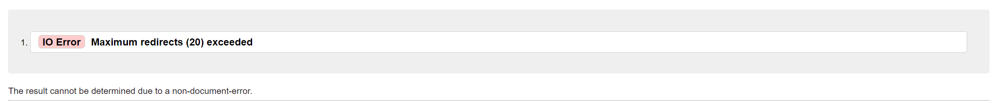
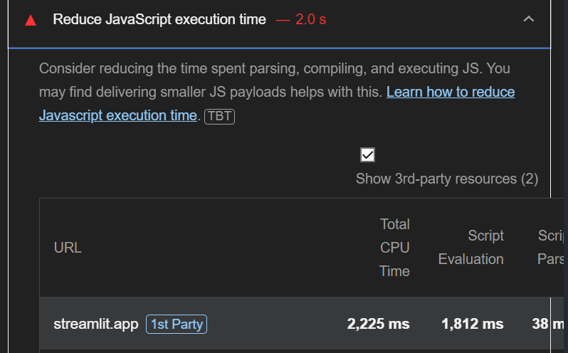
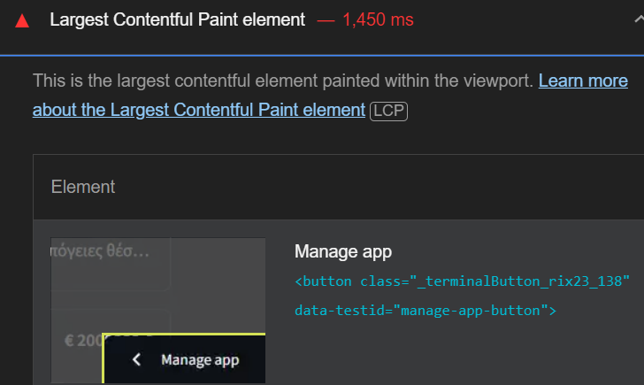

# **TESTING**

The PropertyList website has been tested manually as well as with automated services like code validators and browser developer tools.

# **Contents**

- [**TESTING**](#testing)
- [**Contents**](#contents)
  - [**Code Validators**](#code-validators)
    - [*w3schools HTML Validator*](#w3schools-html-validator)
    - [Extendsclass Python Validator](#extendsclass-python-validator)
  - [**Features Testing**](#features-testing)
  - [**Responsiveness Test**](#responsiveness-test)
  - [**Browser Compatibility**](#browser-compatibility)
  - [**Testing User Stories**](#testing-user-stories)
  - [**Perofrmance**](#perofrmance)
  - [**Known Bugs**](#known-bugs)
  - [**Future Implementations**](#future-implementations)
  - [**Lighthouse**](#lighthouse)
  
## **Code Validators**

### *[w3schools HTML Validator](https://validator.w3.org)*

- [Home Page](https://propertylister.streamlit.app)
  
  

- [List Page](https://propertylister.streamlit.app/list)
  
  

- [Map Page](https://propertylister.streamlit.app/app)
  
  

  ### *[Extendsclass Python Validator](https://extendsclass.com/python-tester.html)*

- [Home Page](https://propertylister.streamlit.app)
  
  

- [List Page](https://propertylister.streamlit.app/list)
  
  

- [Map Page](https://propertylister.streamlit.app/app)
  
  

# **Feature Testing Documentation – PropertyLister**  

## **Navigation Menu**  
- **Expected:** The feature is expected to allow seamless navigation between different sections of the app.  
- **Testing:** Clicked each navigation link manually to ensure it directed to the correct pages (Home, List View, Map View, etc.).  
- **Result:** The feature worked as expected, successfully redirecting to the correct pages.  

## **Property Listings**  
### **List View**  
- **Expected:** Properties should be displayed as cards with images and key details (price, size, location).  
- **Testing:** Opened the List View and verified that properties appeared correctly with their details.  
- **Result:** All properties loaded properly, displaying the correct details and images.  

### **Interactive Map View**  
- **Expected:** Properties should be displayed as markers on an interactive map, and clicking a marker should show property details.  
- **Testing:** Verified that property markers appeared at the correct locations on the map and clicked them to confirm details were displayed.  
- **Result:** Markers displayed properly, and clicking them revealed the correct property details. 

### **Pagination Feature**  
- **Expected:** The pagination feature should allow users to navigate through a large list of properties, displaying a set number of properties per page, with the ability to move between pages.  
- **Testing:** Navigated through multiple pages of properties, ensuring that the correct number of properties were shown per page and that the pagination controls worked (e.g., next, previous, specific page).  
- **Result:** The pagination feature worked as expected. Properties were displayed in sets, and navigation through pages was smooth without any errors.  

## **Full Details View**  
- **Expected:** Clicking on a property should open a detailed view with all relevant information. The user should be able to toggle between images and the map.  
- **Testing:** Clicked on multiple property listings to ensure the details page loaded correctly. Toggled between the **image** and **map** views.  
- **Result:** The feature worked as expected; the full details loaded correctly, and the toggle function worked seamlessly.  

## **Advanced Search & Filtering**  
### **Keyword Search**  
- **Expected:** Users should be able to search for properties using keywords.  
- **Testing:** Entered various keywords into the search bar and checked if relevant properties appeared.  
- **Result:** The feature correctly displayed relevant properties matching the search query.  

### **Sorting & Filtering**  
- **Expected:** Users should be able to sort and filter properties by **min/max price, surface area, construction year, parking, and storage availability**.  
- **Testing:** Applied different filters and sorting options to see if results updated accordingly.  
- **Result:** The filters and sorting functioned correctly, displaying only properties that matched the selected criteria.  

## **Data Insights & Analytics**  
- **Expected:** The home page should display key metrics such as the total number of properties and the average price.  
- **Testing:** Verified that statistics updated dynamically when new data was added or removed.  
- **Result:** The statistics displayed correctly, reflecting the latest data in the database.  

## **Upload Own Data**  
- **Expected:** Users should be able to upload new property listings successfully.  
- **Testing:** Uploaded sample property data and checked if it appeared correctly in the list and map views.  
- **Result:** The data upload was successful, and new listings appeared as expected.  

## **Language Toggle (EN/GR)**  
- **Expected:** Users should be able to switch between **English** and **Greek**.  
- **Testing:** Toggled between both languages and verified that UI elements and property details updated accordingly.  
- **Result:** The language toggle worked as expected, switching the interface language without errors.  

[Back to top](#contents)

- ## Perofrmance 

    |         |**Home**|**Products**| **Product Details**|
    |---------|--------|------------|--------------------|
    |  Buttons |   Pass  |   Pass    |  Pass   |
    |  Links |   Pass  |   Pass    |  Pass   |
    |  Images |   Pass  |   Pass    |  Pass   |
    |  Nav Links |   Pass  |   Pass    |  Pass   |
    |  Search |   Pass  |   Pass    |  Pass   |
    |  Filtering |   Pass  |   Pass    |  Pass   |
    |  Upload CSV |   Pass  |   Pass    |  Pass   |
    |  Language Toggle |   Pass  |   Pass    |  Pass   |

[Back to top](#contents)

## **Browser Compatibility**

PropertyLister has been tested in multiple browsers with no visible issues. Google Chrome, Mozilla Firefox, Safari, Microsoft Edge and Opera.Appearance, functionality and responsiveness were found consistent throughout on a range of device sizes and browsers.

[Back to top](#contents)

## **Responsiveness Test**

Responsiveness tests were carried out manually with a combination of device testing and [Google Chrome Developer Tools](https://developer.chrome.com/docs/devtools/).
    

|         |**iPhone 11**|**Samsung Galaxy S8+**| **Pixel 5**|**iPad Mini**|**iPad Air**|**iPad Pro**|**Display <1200px**|**Display >1200px**|
|---------|-------------|----------------------|------------|-------------|------------|------------|-------------------|-------------------|
|  Render |   Pass      |       Pass           |  Pass      |    Pass     |   Pass     |  Pass      | Pass              |      Pass         |
|  Images |   Pass      |       Pass           |  Pass      |    Pass     |   Pass     |  Pass      | Pass              |      Pass         |
|  Links  |   Pass      |       Pass           |  Pass      |    Pass     |   Pass     |  Pass      | Pass              |      Pass         |

[Back to top](#contents)

# **Testing User Stories**

## **Viewing and Navigation**

- **As a user, I want to view a list of properties, so I can browse through available items.**
  
    - **Expected:** Users should be able to see a list of properties.
    - **Testing:** Navigated to the list view page and verified that properties were displayed correctly.
    - **Result:** Successfully displayed a list of properties.

- **As a user, I want to view individual property details, so I can learn more about the item before purchasing.**
  
    - **Expected:** Users should be able to click on a property and view detailed information about it.
    - **Testing:** Clicked on various properties and verified that the full details page loaded with correct information.
    - **Result:** Successfully displayed detailed property information when clicked.

- **As a user, I want to easily switch between map and image view in the property details page, so I can easily see the property's location.**
  
    - **Expected:** Users should be able to toggle between the map and image view.
    - **Testing:** Toggled between map and image view on the property details page and ensured the toggle function worked smoothly.
    - **Result:** The toggle feature worked correctly, switching between views seamlessly.

- **As a user, I want to see a description of each property listing, so I can read more details around potential purchases.**
  
    - **Expected:** Each property listing should have a description, highlighting key details such as features, price, etc.
    - **Testing:** Checked various properties to ensure each listing had a visible description with essential details.
    - **Result:** Each property listing correctly displayed a detailed description.

## **Sorting and Searching**

- **As a user, I want to sort properties by various criteria (e.g., min/max price, min/max surface area), so I can easily find what I am looking for.**
  
    - **Expected:** Users should be able to sort properties by price, size, and other relevant criteria.
    - **Testing:** Applied sorting filters (price, size) and ensured that properties were sorted as per the selected criteria.
    - **Result:** Properties were sorted correctly based on the selected criteria.

- **As a user, I want to filter properties based on attributes (e.g., parking, storage), so I can narrow down my choices.**
  
    - **Expected:** Users should be able to filter properties based on selected attributes.
    - **Testing:** Applied various filters (parking, storage, etc.) and verified that only properties meeting the criteria were displayed.
    - **Result:** Filtering worked correctly, showing only properties matching the selected attributes.

- **As a user, I want to search for properties by keywords, so I can quickly locate specific items.**
  
    - **Expected:** Users should be able to search for properties using specific keywords.
    - **Testing:** Entered various keywords in the search bar and checked if the correct properties were shown.
    - **Result:** The search feature worked correctly, returning relevant properties based on the keyword.

## **Interactive Map View with Markers**

- **As a user, I want to view properties on an interactive map with markers, so I can easily see their locations.**
  
    - **Expected:** Properties should be displayed as markers on the map, with a clear location.
    - **Testing:** Verified that each property was represented by a marker on the map, and clicking on a marker showed property details.
    - **Result:** Markers were displayed correctly on the map, and clicking them revealed relevant property details.

- **As a user, I want to filter properties on the map based on attributes (e.g., parking, storage), so I can narrow down my choices visually.**
  
    - **Expected:** Users should be able to filter properties on the map by selected attributes.
    - **Testing:** Applied filters (e.g., parking, storage) and ensured only relevant markers were displayed on the map.
    - **Result:** Filtering by attributes worked as expected, updating the markers accordingly.

- **As a user, I want to search for properties by keywords within the map view, so I can quickly locate specific listings in my area of interest.**
  
    - **Expected:** Users should be able to search by keywords in the map view.
    - **Testing:** Entered various keywords in the search bar while in map view and verified that markers updated to show relevant properties.
    - **Result:** The keyword search worked within the map view, filtering the map markers correctly.

- **As a user, I want to sort properties displayed on the map by criteria (e.g., min/max price, min/max surface area), so I can prioritize listings based on my preferences.**
  
    - **Expected:** Users should be able to sort properties on the map by price, size, etc.
    - **Testing:** Applied sorting options to properties on the map and checked that the markers updated to reflect the sorted listings.
    - **Result:** Sorting worked correctly within the map view, prioritizing listings based on selected criteria.

## **Language Toggle**

- **As a user, I want the option to change between Greek and English language, so I can use the app even if I do not speak Greek.**
  
    - **Expected:** Users should be able to toggle between Greek and English for the interface language.
    - **Testing:** Switched between Greek and English languages and ensured all UI elements and content updated accordingly.
    - **Result:** The language toggle feature worked as expected, allowing smooth transition between languages.

## **Upload Data**

- **As a user, I want to have the option of uploading my own property listing data, so I can explore my own set of data.**
  
    - **Expected:** Users should be able to upload their own property listings to the app.
    - **Testing:** Tested the data upload feature by uploading a sample dataset and verified that the data appeared in the listings.
    - **Result:** The upload feature worked successfully, and the new data appeared as expected in the property listings.

## **Analytics**

- **As a user, I want to have access to analytics around the properties such as mean price and number of properties, so I can better inform my decision.**
  
    - **Expected:** Users should be able to view key metrics like the mean price and number of properties available.
    - **Testing:** Verified that the homepage displayed relevant analytics, including average price and total properties.
    - **Result:** The analytics were displayed correctly on the homepage, showing accurate and up-to-date data.

[Back to top](#contents)

## **Known Bugs**

### **Map Loading Time**
- **Issue:** Due to the large number of properties and the creation of markers for each one, the map takes a long time to load and re-renders can be slow. This delay can impact the user experience, especially when browsing properties on the map.
- **Workaround:** No current workaround for the loading time. However, efforts are underway to optimize the performance for faster loading and smoother interactions.

### **Map to Image Toggle**
- **Issue:** On the full details page of a property, there is an option to toggle between image and map view. However, Streamlit sometimes needs to rerun the page to update session state variables so that they take effect in specific components. Due to the details page being a modal, a potential rerun causes the modal to close, resulting in a poor user experience. Additionally, the page does not toggle back from map view to image view as expected.
- **Workaround:** A 1px wide placeholder Folium map initialization forces the necessary rerun, ensuring the session state updates correctly **without closing the modal**.

[Back to top](#contents)

## **Future Implementations**

### **1. Implement Clustering for Markers**
- **Description:** To improve map performance and reduce the number of markers that need to be loaded at once, marker clustering will be implemented. This will group nearby markers together into a single cluster to improve load time and enhance the map interaction, especially for large datasets.
- **Expected Outcome:** By clustering markers, the map will load faster and the user experience will be much smoother, with improved responsiveness and minimal re-rendering issues.

[Back to top](#contents)

### **Lighthouse**

The website has been tested using [Google Lighthouse](https://developer.chrome.com/docs/lighthouse/overview/) to test individual pages on:

- Performance - how does the page perform on loading?
- Accessibility - is the website accessible to all users?
- Best Practices - Does the code follow best practices?
- SEO - Is the pages optimized for search engines?

  An example of the Lighthouse results on both Chrome and Opera Browser at the Guilty Sheep movie card page is shown below:

  
  

  Results varied depending on browser, but wesite perfrmace seems to be low. Based on the lighthouse performance analysis it seems that Streamlit Cloud deployment maybe causeing the performance drop

  
  

Back to [README.md](./README.md#testing).

